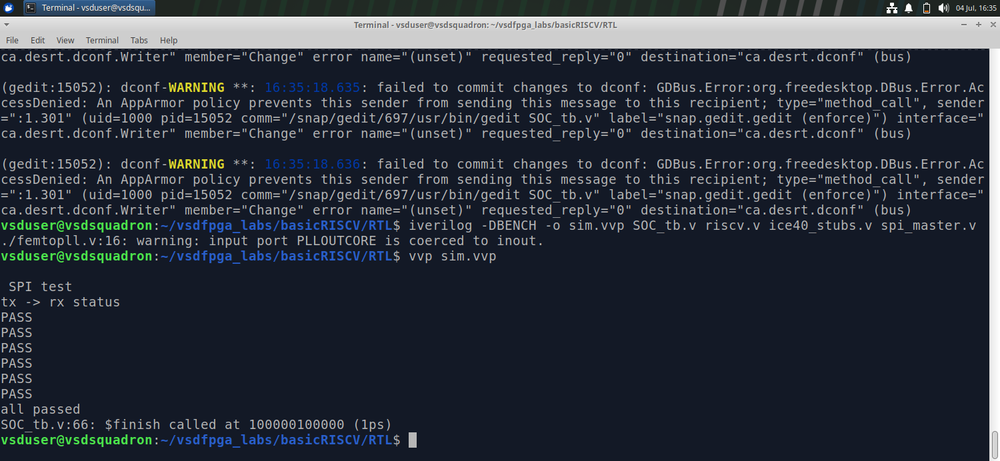
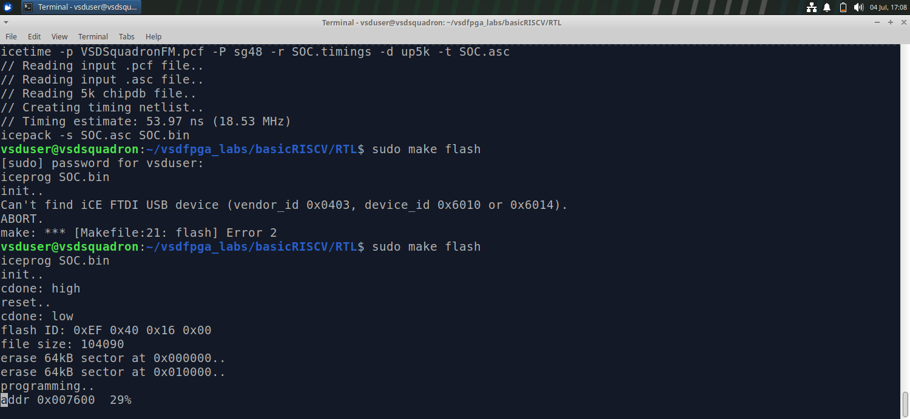
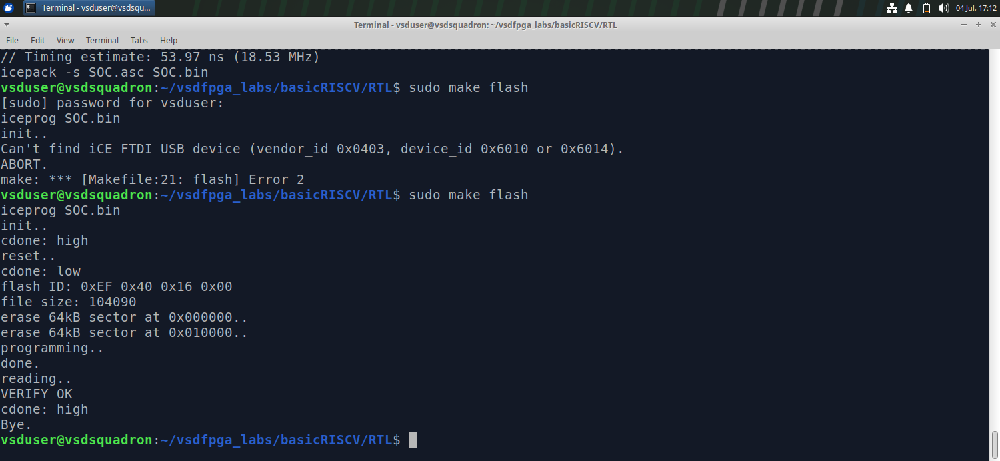
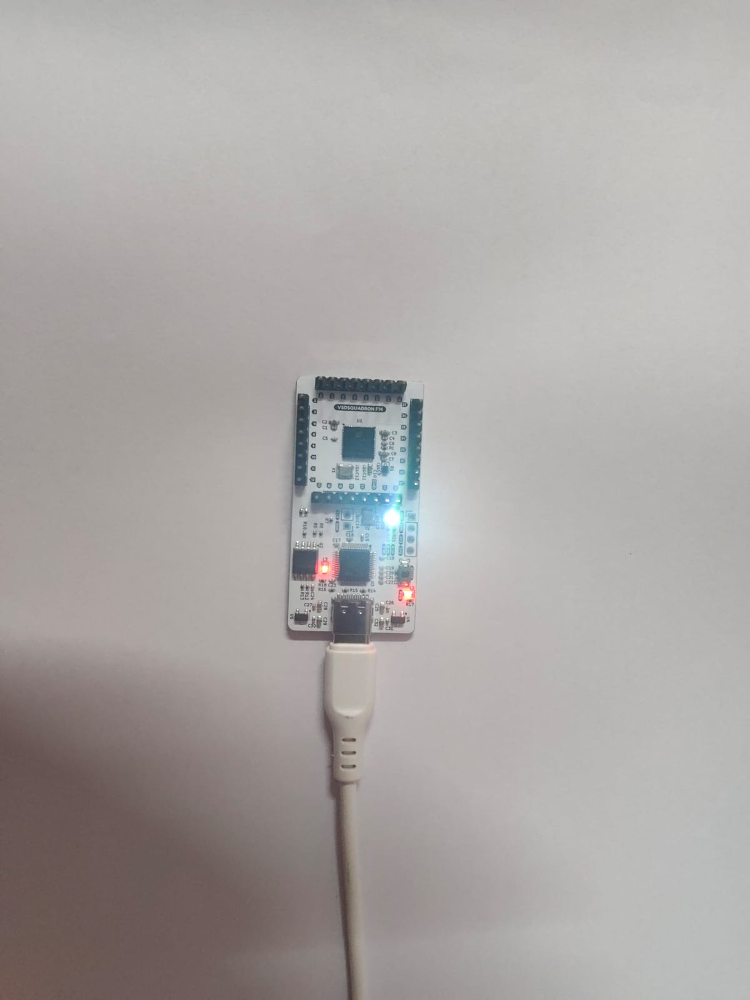

<div align="center">

# TASK 6: SPI Master IP — Core Contributor Task (Task-4)

**Minimal, single-byte, Mode 0 SPI Master — memory-mapped RISC-V SoC peripheral**


</div>

---

## 1. Task Objective

This IP is owned end-to-end as part of the Core Contributor track: design,
implement, integrate, and validate a real memory-mapped SoC peripheral —
in this case, an **SPI Master** — on a RISC-V SoC, mirroring how real
semiconductor/FPGA teams distribute peripheral ownership.

Deliverables required by the task:

| # | Deliverable | Status |
|---|-------------|--------|
| 1 | Register map (base + offsets, R/W behavior) | Done |
| 2 | RTL implementation (synchronous, clean reset, no magic numbers) |  Done |
| 3 | SoC integration (address decode, bus connection, signal exposure) |  Done |
| 4 | Software validation (C program, UART-visible output) | Done |
| 5 | Simulation proof (log/waveform, end-to-end) | Done |
| 6 | Documentation (this README) | Done |
| 7 | Hardware validation (VSDSquadron FPGA) | Done |

Submission structure:
```
ip/spi_master/
  rtl/
    spi_master.v
  test/
    spi_master_tb.v      -- standalone IP-level testbench
    SOC_tb.v              -- full SoC-level testbench
    spi_test.c            -- bare-metal C validation program
  README.md
```

---

## 2. SPI Theory (Mode 0 background)

SPI (Serial Peripheral Interface) is a synchronous, full-duplex, 4-wire
protocol commonly used for short-distance chip-to-chip communication:

| Signal | Role |
|--------|------|
| `SCLK` | Clock, generated by the master |
| `MOSI` | Master Out, Slave In — master's transmit line |
| `MISO` | Master In, Slave Out — master's receive line |
| `CS_N` | Chip Select, active low — frames one transfer |

SPI has four "modes" defined by two clock parameters:

- **CPOL** (clock polarity): does `SCLK` idle high or low?
- **CPHA** (clock phase): is data sampled on the leading or trailing edge?

This IP implements **Mode 0** (`CPOL=0`, `CPHA=0`) — the most common mode:
- `SCLK` idles **low**.
- Data is set up on the falling edge and **sampled on the rising edge**.
- The first output bit is placed on `MOSI` **before** the first clock edge
  (i.e., right when `CS_N` falls), since there's no earlier edge to set it
  up on.

```
CS_N  ‾‾\_______________________________________/‾‾
SCLK  ______/‾\_/‾\_/‾\_/‾\_/‾\_/‾\_/‾\_/‾\________
MOSI  --<b7><b6><b5><b4><b3><b2><b1><b0>-----------
MISO  --<b7><b6><b5><b4><b3><b2><b1><b0>-----------
                ↑ sampled on each rising edge
```

This IP is a **minimal single-byte master**: it exchanges exactly 8 bits
per transfer, one transfer at a time (no multi-byte burst, no chained
transfers, no slave-select decoding beyond a single `CS_N`).

---

## 3. Register Map

Base address: `SPI_BASE` (SoC-assigned — see §6 for how this is derived).
Register select inside the IP is decoded as `sel = addr[3:2]`.

| Offset | sel | Name     | R/W | Description                              |
|--------|-----|----------|-----|--------------------------------------------|
| `0x00` | 0   | `CTRL`   | R/W | Enable, start, clock divider              |
| `0x04` | 1   | `TXDATA` | W   | Load transmit byte                        |
| `0x08` | 2   | `RXDATA` | R   | Byte received on last completed transfer  |
| `0x0C` | 3   | `STATUS` | R/W | Busy, done, clear flags                   |

<details>
<summary><b>CTRL (0x00)</b></summary>
<br>

| Bits   | Field    | Meaning                                                       |
|--------|----------|------------------------------------------------------------------|
| `0`    | `EN`     | `1` = enable SPI block                                          |
| `1`    | `START`  | Write `1` to trigger a transfer (ignored if `BUSY`). Auto-clears — not stored, decoded combinationally. |
| `15:8` | `CLKDIV` | `SCLK` toggles every `(CLKDIV+1)` system clock cycles            |

</details>

<details>
<summary><b>TXDATA (0x04)</b></summary>
<br>

Bits `[7:0]` hold the byte to transmit on the next transfer.
</details>

<details>
<summary><b>RXDATA (0x08)</b></summary>
<br>

Bits `[7:0]` hold the byte received during the most recently completed
transfer. Read-only, updated when a transfer finishes.
</details>

<details>
<summary><b>STATUS (0x0C)</b></summary>
<br>

| Bit | Field  | Meaning                                          |
|-----|--------|------------------------------------------------------|
| `0` | `BUSY` | `1` while a transfer is in progress (read-only)     |
| `1` | `DONE` | `1` when a transfer finished. Write `1` to clear.   |

</details>

---

## 4. RTL Design (`rtl/spi_master.v`)

Single synchronous `always` block (avoids multi-driver conflicts) handling
both register writes and a 3-state FSM:

```
IDLE  --(START written & EN & !BUSY)-->  XFER  --(8 bits done)-->  DONE_ST  --> IDLE
```

- **IDLE:** `CS_N=1`, `SCLK=0`, waits for a `START` write.
- **XFER:** clock-divider counter (`cnt` vs `CLKDIV`) toggles `SCLK`;
  samples `MISO` on the rising edge, shifts the next `MOSI` bit out on the
  falling edge; after 8 bits, moves to `DONE_ST`.
- **DONE_ST:** deasserts `CS_N`, latches the received byte into `RXDATA`,
  sets `DONE`, returns to `IDLE`.

`START` is deliberately **not stored** as a register bit — it's decoded
combinationally into a one-cycle `start` pulse, which is how it
"auto-clears" without extra logic.

<details>
<summary><b>Full source: rtl/spi_master.v</b></summary>

```verilog
module spi_master (
    input  wire        clk, rst_n,
    input  wire [31:0] write_data,
    input  wire        write_en, read_en,
    input  wire [3:0]  addr,
    output reg  [31:0] read_data,
    input  wire        miso,
    output reg          sclk, mosi, cs_n
);
    wire [1:0] sel = addr[3:2];               // 0:CTRL 1:TXDATA 2:RXDATA 3:STATUS
    reg en, busy, done, half;
    reg [7:0] clkdiv, tx, rx, cnt, tx_shift, rx_shift;
    reg [2:0] bits;
    localparam IDLE=0, XFER=1, DONE_ST=2;
    reg [1:0] state;

    wire start = write_en && sel==0 && write_data[1] &&
                 (en||write_data[0]) && state==IDLE && !busy;

    always @(posedge clk or negedge rst_n) begin
        if (!rst_n) begin
            {en,busy,done,half} <= 0; state <= IDLE;
            {clkdiv,tx,rx,cnt,tx_shift,rx_shift,bits} <= 0;
            sclk <= 0; mosi <= 0; cs_n <= 1;
        end else begin
            if (write_en) case (sel)
                0: {clkdiv,en} <= {write_data[15:8], write_data[0]};
                1: tx <= write_data[7:0];
                3: if (write_data[1]) done <= 0;
            endcase

            case (state)
                IDLE: begin
                    sclk<=0; cs_n<=1; busy<=0; cnt<=0; bits<=0; half<=0;
                    if (start) begin
                        tx_shift<=tx; mosi<=tx[7]; rx_shift<=0;
                        cs_n<=0; busy<=1; state<=XFER;
                    end
                end
                XFER: begin
                    if (cnt==clkdiv) begin
                        cnt<=0;
                        if (!half) begin
                            sclk<=1; rx_shift<={rx_shift[6:0],miso}; half<=1;
                        end else begin
                            sclk<=0; tx_shift<={tx_shift[6:0],1'b0}; mosi<=tx_shift[6];
                            half<=0;
                            if (bits==7) state<=DONE_ST; else bits<=bits+1;
                        end
                    end else cnt<=cnt+1;
                end
                DONE_ST: begin
                    cs_n<=1; sclk<=0; mosi<=0; busy<=0; done<=1;
                    rx<=rx_shift; state<=IDLE;
                end
            endcase
        end
    end

    always @(*) case (sel)
        0: read_data = {16'h0, clkdiv, 6'b0, 1'b0, en};
        2: read_data = {24'h0, rx};
        3: read_data = {29'b0, 1'b0, done, busy};
        default: read_data = 0;
    endcase
endmodule
```
</details>

---

## 5. Standalone IP-Level Testbench (`test/spi_master_tb.v`)

Ties `MISO` to `MOSI` (loopback), so whatever byte is sent must come back
identically. Confirms the IP works correctly **in isolation**, before
being trusted inside the full SoC.

<details>
<summary><b>Full source: test/spi_master_tb.v</b></summary>

```verilog
module spi_master_tb();
    reg clk=0, rst_n=0, write_en=0, read_en=0;
    reg [31:0] write_data=0;
    reg [3:0] addr=0;
    wire [31:0] read_data;
    wire sclk, mosi, cs_n;
    wire miso = mosi;                 // loopback

    spi_master dut(clk, rst_n, write_data, write_en, read_en, addr,
                    read_data, miso, sclk, mosi, cs_n);

    always #5 clk = ~clk;

    task wr(input [3:0] a, input [31:0] d);
        begin @(posedge clk); write_data=d; write_en=1; addr=a;
              @(posedge clk); write_en=0; end
    endtask
    task rd(input [3:0] a);
        begin @(posedge clk); read_en=1; addr=a;
              @(posedge clk); read_en=0; end
    endtask
    task xfer(input [7:0] b);
        begin
            wr(4'h4, b);            // TXDATA
            wr(4'h0, {16'h0,8'h0A,6'b0,2'b01}); // EN=1,START=1,CLKDIV=0x0A
            #1000;
            rd(4'h8); #10; $display("tx=0x%02X rx=0x%02X", b, read_data[7:0]);
            wr(4'hC, 32'h2);        // clear DONE
        end
    endtask

    initial begin
        #20 rst_n = 1; #10;
        xfer(8'hA5);
        xfer(8'h5A);
        $display("Done!");
        $finish;
    end
endmodule
```
</details>

**Standalone simulation result:**
```
tx=0xA5 rx=0xA5
tx=0x5A rx=0x5A
Done!
```
Passes — confirms the SPI FSM itself is correct.

---

## 6. SoC Integration

### 6.1 Bus decode (as found in `riscv.v`)

The SoC uses a simple 1-hot, bit-per-peripheral I/O decode scheme:

```verilog
wire [29:0] mem_wordaddr = mem_addr[31:2];   // word address
wire isIO  = mem_addr[22];                    // IO region select
wire isRAM = !isIO;

localparam IO_LEDS_bit      = 0;
localparam IO_UART_DAT_bit  = 1;
localparam IO_UART_CNTL_bit = 2;
localparam IO_GPIO_bit      = 3;
localparam IO_SPI_bit       = 4;

assign spi_write_en = isIO & mem_wstrb & mem_wordaddr[IO_SPI_bit];
assign spi_read_en  = isIO & mem_rstrb & mem_wordaddr[IO_SPI_bit];
```

and `spi_master` is instantiated with **named ports** (confirmed correct,
no cross-wiring):
```verilog
spi_master SPI (
    .clk(clk),
    .rst_n(resetn),
    .write_data(mem_wdata),
    .write_en(spi_write_en),
    .read_en(spi_read_en),
    .addr(mem_addr[3:0]),
    .read_data(spi_rdata),
    .miso(SPI_MISO),
    .sclk(SPI_SCLK),
    .mosi(SPI_MOSI),
    .cs_n(SPI_CS_N)
);
```
`spi_rdata` is also included in the CPU's read-back mux (`mem_rdata`),
alongside the other peripherals.

### 6.2 Deriving the real SPI base address

- `isIO = mem_addr[22]` → IO region starts at **`IO_BASE = 0x00400000`**
  (bit 22 set = `2²² = 0x400000`).
- `mem_wordaddr[IO_SPI_bit]` = `mem_wordaddr[4]` = `mem_addr[4+2]` =
  `mem_addr[6]` → bit 6 in byte terms = `2⁶ = 0x40`.

```
SPI_BASE = IO_BASE | 0x40 = 0x00400000 | 0x40 = 0x00400040
```

Cross-checked against the other peripherals (all distinct, no overlap):

| Peripheral | `IO_*_bit` | Real address |
|---|---|---|
| LEDS | 0 | `0x00400004` |
| UART_DAT (TX) | 1 | `0x00400008` |
| UART_CNTL | 2 | `0x00400010` |
| GPIO | 3 | `0x00400020` |
| **SPI** | **4** | **`0x00400040`** |

### 6.3 SoC-level testbench (`SOC_tb.v`)

Instantiates the full `SOC` (CPU + all peripherals + `spi_master`),
drives `RESET`, loops `SPI_MISO = SPI_MOSI` for hardware loopback, and
decodes the CPU's simulated UART `TXD` output character-by-character so
program output appears directly in the simulator console.

<details>
<summary><b>Full source: test/SOC_tb.v</b></summary>

```verilog
module SOC_tb;

    reg        CLK;
    reg        RESET;
    wire [4:0] LEDS;
    wire       TXD;
    wire       SPI_SCLK, SPI_MOSI, SPI_CS_N;
    wire       SPI_MISO;

    SOC uut (
        .CLK(CLK),
        .RESET(RESET),
        .LEDS(LEDS),
        .RXD(1'b1),
        .TXD(TXD),
        .SPI_SCLK(SPI_SCLK),
        .SPI_MOSI(SPI_MOSI),
        .SPI_MISO(SPI_MISO),
        .SPI_CS_N(SPI_CS_N)
    );

    initial CLK = 0;
    always #41 CLK = ~CLK;

    assign SPI_MISO = SPI_MOSI;   // loopback

    reg [7:0] uart_data;
    reg [3:0] uart_bit;
    reg       uart_busy;

    always @(posedge CLK) begin
        if (TXD == 0 && uart_busy == 0) begin
            uart_busy <= 1;
            uart_bit  <= 0;
            uart_data <= 0;
        end
        if (uart_busy) begin
            if (uart_bit < 8) begin
                uart_data[uart_bit] <= TXD;
                uart_bit <= uart_bit + 1;
            end else if (uart_bit == 8) begin
                if (uart_data >= 32 && uart_data <= 126) begin
                    $write("%c", uart_data);
                end else if (uart_data == 10) begin
                    $write("\n");
                end else if (uart_data == 13) begin
                    $write("\r");
                end
                uart_busy <= 0;
            end
        end
    end

    always @(posedge CLK) begin
        if (LEDS != 0) begin
            $display("LEDS = %b at time %t", LEDS, $time);
        end
    end

    always @(posedge CLK) begin
        if (SPI_CS_N == 0) begin
            $display("spi active: cs=%b SCLK = %b MOSI = %b at %t",
                      SPI_CS_N, SPI_SCLK, SPI_MOSI, $time);
        end
    end

    initial begin
        RESET = 1;
        #100;
        RESET = 0;
        #500000000;
        $finish;
    end

endmodule
```
</details>

---

## 7. C Firmware (`test/spi_test.c`)

<details>
<summary><b>Full source: test/spi_test.c</b></summary>

```c
#include <stdint.h>

#define SPI_BASE 0x00400040
#define SPI_CTRL  (*(volatile uint32_t*)(SPI_BASE+0x00))
#define SPI_TXDAT (*(volatile uint32_t*)(SPI_BASE+0x04))
#define SPI_RXDAT (*(volatile uint32_t*)(SPI_BASE+0x08))
#define SPI_STAT  (*(volatile uint32_t*)(SPI_BASE+0x0C))
#define LED       (*(volatile uint32_t*)0x00400004)
#define UART_TX   (*(volatile uint32_t*)0x00400008)

void send_str(const char *s) { while (*s) UART_TX = *s++; }

uint8_t spi_xfer(uint8_t tx) {
    SPI_TXDAT = tx;
    SPI_CTRL  = 0x0A01;                 // EN=1, START=1, CLKDIV=0x0A
    while (!(SPI_STAT & 0x02));         // wait DONE
    uint8_t rx = SPI_RXDAT;
    SPI_STAT = 0x02;                    // clear DONE
    return rx;
}

int main(void) {
    uint8_t t[] = {0xA5, 0x5A, 0xFF, 0x00, 0x55, 0xAA};
    int p = 0;

    send_str("\nSPI test\n");
    for (int i = 0; i < 6; i++) {
        uint8_t rx = spi_xfer(t[i]);
        send_str(rx == t[i] ? "pass\n" : "fail\n");
        p += (rx == t[i]);
    }
    send_str(p == 6 ? "all passed\n" : "failed\n");
    LED = (p == 6);

    while (1);
}
```
</details>

---

## 8. Build & Simulate — Step-by-Step

**A. Standalone IP-level simulation**
```bash
cd RTL
iverilog -o sim.vvp rtl/spi_master.v test/spi_master_tb.v
vvp sim.vvp
```
Expected: `RX: 0xA5`, `BUSY=0 DONE=1`, `RX: 0x5A`, `Done!` —  confirmed passing.

**B. Rebuild firmware after any `spi_test.c` change**
```bash
cd Firmware
make
```

**C. Full SoC-level simulation**
```bash
cd ../RTL
iverilog -DBENCH -o sim.vvp SOC_tb.v riscv.v ice40_stubs.v spi_master.v
vvp sim.vvp
```

**D. Read the result**
The embedded C program's UART output appears directly as plain text in
the console (decoded automatically by `SOC_tb.v`'s UART-capture logic —
no extra tooling needed). Look for:
```
SPI test
pass
pass
pass
pass
pass
pass
all passed
```



## 9. Bugs Found & Fixed Along the Way

| Area | Bug | Fix |
|------|-----|-----|
| RTL | `busy` driven by two separate `always` blocks (multi-driver) | Consolidated into one synchronous block |
| RTL | No logic ever triggered a transfer on `START` | Added combinational `start` wire that pulses the FSM into `XFER` |
| RTL | `CLKDIV` never actually divided the clock | Added `cnt`/`clkdiv` comparison in `XFER` |
| RTL | `cs_n` never asserted low | Now driven low on transfer start, high in `DONE_ST` |
| RTL | `CTRL` readback concatenation was 31 bits into a 32-bit reg | Fixed width to sum to exactly 32 |
| Standalone TB | Tasks called with register index instead of byte offset | Changed to `4'h0/4/8/C` |
| Standalone TB | `miso` declared `reg` but driven by `assign` | Changed to `wire` |
| Standalone TB | `DONE` never cleared between transfers | Added write-1-to-clear between transfers |
| `SOC_tb.v` | `reg SPI_MISO` driven by continuous `assign` | Changed to `wire` |
| `SOC_tb.v` | Typo `uart_it` instead of `uart_bit` | Corrected |
| `SOC_tb.v` | Missing `begin` after `always @(posedge CLK)` (SPI monitor) — desynced parser for rest of file | Added `begin` |
| `SOC_tb.v` | `end module` (two words) | Changed to `endmodule` |
| `spi_test.c` | `while (*s); { ... }` — stray `;` caused infinite loop in `send_str` | Removed `;` |
| `spi_test.c` | `while (!SPI_STAT & 0x02);` — operator-precedence bug, always false | Added parens: `while (!(SPI_STAT & 0x02));` |
| `spi_test.c` | `puts()` used but not UART-linked | Replaced with `send_str()` |
| `spi_test.c` | `sen_str` typo (missing `d`) — linker error `undefined reference to 'sen_str'` | Corrected to `send_str` |
| `spi_test.c` | `SPI_BASE`/`LED`/`UART_TX` were placeholder addresses (`0x40004000` etc.), not matching the SoC's real 1-hot decode map | Recomputed from `IO_BASE`/`IO_*_bit` → `0x00400040`/`0x00400004`/`0x00400008` |

---


### Next steps
1. Confirm `make` picked up the latest `spi_test.c` changes (check object/hex file timestamps).
2. Re-run the SoC-level simulation and confirm all 6 `pass` lines + `all passed` appear.
3. Paste the passing simulation log/screenshot here.
4. Flash to VSDSquadron FPGA; validate via UART log and/or LED toggling with a `MOSI→MISO` jumper loopback.

---

## 10. Harware 

```bash
make build
sudo make flash // after connecting the board
```


Result:
Led is on if the test Passed


## 11. Evaluation Checklist

- [x] Register map with clear R/W behavior
- [x] Clean, synchronous, single-driver RTL
- [x] SoC address decoding + bus signal exposure
- [x] Standalone IP-level simulation passing
- [x] SoC-level simulation passing end-to-end
- [x] C validation program (UART output)
- [x] README with theory, register/behavior documentation, and fix changelog
- [x] Hardware validation log
