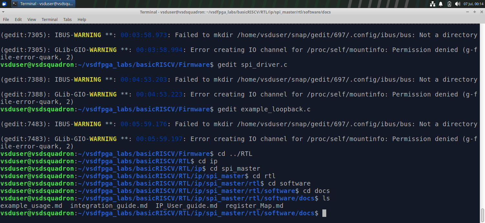
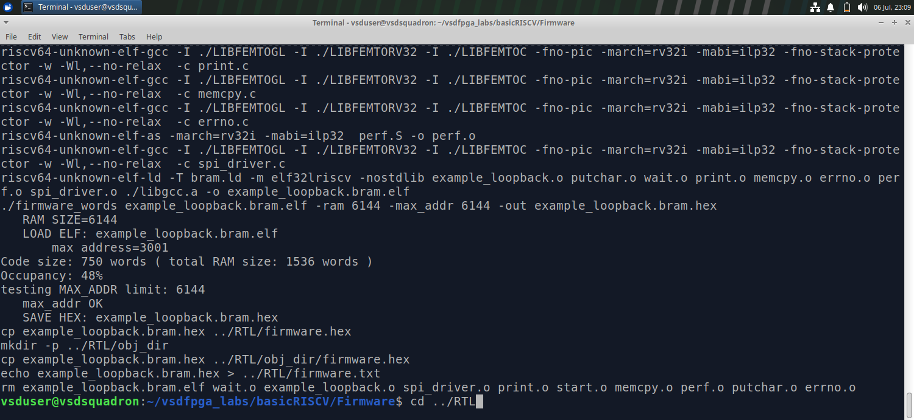
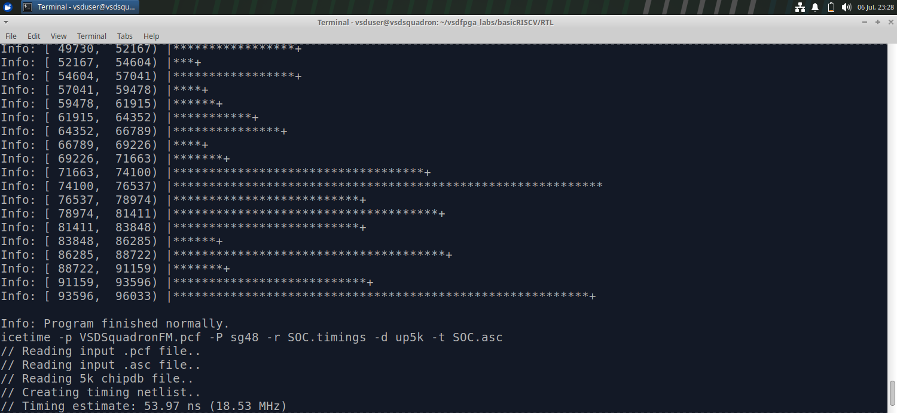
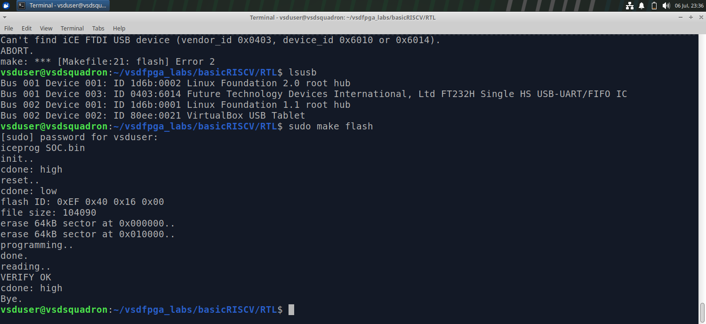
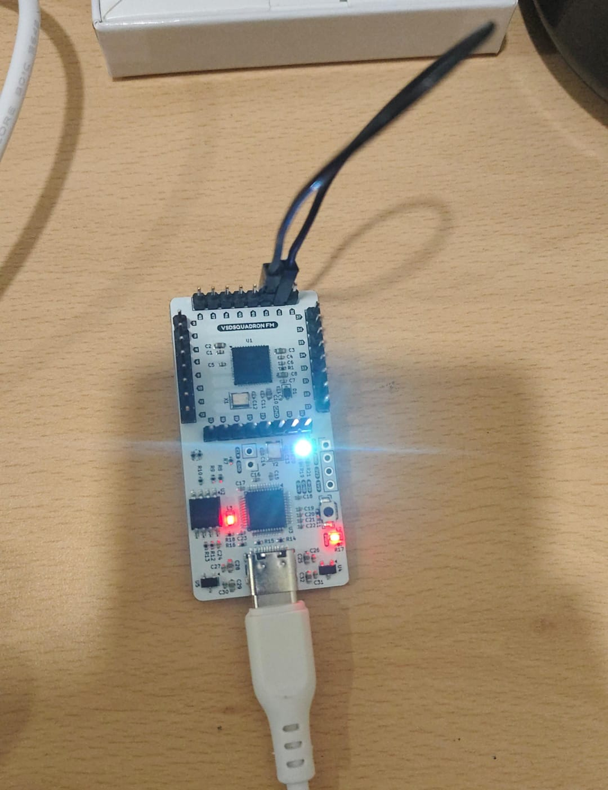

# SPI Master IP for VSDSquadron FM BasicRISCV
## "Plug and play IP"

## Overview

This repository contains a memory-mapped **SPI (Serial Peripheral Interface) Master IP** for the VSDSquadron FM BasicRISCV SoC.

The IP enables the RISC-V processor to communicate with SPI peripherals such as Flash memory, sensors, ADCs, DACs, displays, and EEPROMs using a simple software driver and memory-mapped registers.

---
## IP Overview
### Purpose of the IP

The SPI Master IP provides a memory-mapped Serial Peripheral Interface (SPI) controller for the VSDSquadron FM BasicRISCV SoC. It enables the RISC-V processor to communicate with SPI-compatible peripheral devices through a simple register interface. The IP manages SPI clock generation, chip-select control, and full-duplex serial data transfers, making it easy for software to exchange data with external devices.

### Typical Use Cases

The SPI Master IP can be used to interface the processor with a wide range of SPI peripherals, including:

SPI Flash memory
EEPROM devices
ADC (Analog-to-Digital Converters)
DAC (Digital-to-Analog Converters)
Temperature, pressure, and motion sensors
OLED and LCD displays
SD card modules operating in SPI mode
External microcontrollers and communication modules

### Why/When Someone Would Use It

This IP is useful whenever a processor needs a reliable, hardware-based SPI interface to communicate with external peripherals. Instead of implementing SPI communication entirely in software (bit-banging), the SPI Master IP performs clock generation, data shifting, and status monitoring in hardware, reducing processor overhead and improving communication reliability.

The memory-mapped register interface allows software to initialize the SPI controller, configure the clock divider, transmit data, receive data, and monitor transfer completion using simple register read and write operations. This makes the IP easy to integrate into embedded systems based on the VSDSquadron FPGA platform.

# Repository Structure

```
ip/
└── spi_master/
    ├── rtl/
    ├── software/
    ├── docs/
    └── README.md
```

---


# How to Integrate

1. Copy `rtl/spi_master.v` into your SoC project.
2. Instantiate the SPI Master in `riscv.v`.
3. Connect the address decoder to the SPI registers.
4. Expose the SPI signals (MOSI, MISO, SCLK and CS) to the FPGA top-level.
5. Add the software files:
   - `spi_driver.c`
   - `spi_driver.h`
6. Build the firmware and generate the `.hex` file.
7. Generate the FPGA bitstream and program the board.

📷 **RTL Integration Screenshot**

> *Insert Screenshot Here*

---

# Documentation

Detailed documentation is available in the **docs** folder.

| Document | Description |
|----------|-------------|
| IP_User_Guide.md | IP overview and features |
| Register_Map.md | Register descriptions |
| Integration_Guide.md | SoC integration steps |
| Example_Usage.md | Driver API and example code |
| Step_By_Step_Execution.md | Complete execution procedure |

---

# Software Files

```
software/
├── spi_driver.c
├── spi_driver.h
└── example_loopback.c
```

These files provide the driver API and a ready-to-run SPI loopback example.

---

# How to Test

### Firmware

Compile the firmware:

```bash
make clean
make example_loopback.bram.hex
```

📷 **Firmware Compilation Screenshot**



---

### FPGA

1. Generate the FPGA bitstream.
2. Program the VSDSquadron FPGA.
3. Connect **MOSI** to **MISO** using a jumper wire.
4. Open the UART terminal.
5. Reset the FPGA.

Expected UART output:

```
SPI Loopback Test

Sent     : A5

Received : A5

PASS: loopback matched
```




### Hardware Setup

Connect:

```
MOSI ─────────── MISO
```

SPI_MOSI (Pin 42)
        │
        └──────────────► SPI_MISO (Pin 43)

📷 **Hardware Setup Screenshot**



---

# Features

- Memory-mapped SPI Master
- 8-bit full-duplex transfer
- Configurable SPI clock divider
- Polling-based operation
- Software driver included
- Example application included
- Ready for VSDSquadron BasicRISCV integration

---

# Author

**Nehal Soni**

B.Tech Electronics & Communication Engineering

The LNM Institute of Information Technology (LNMIIT)

VSD FPGA Internship – Task 5
